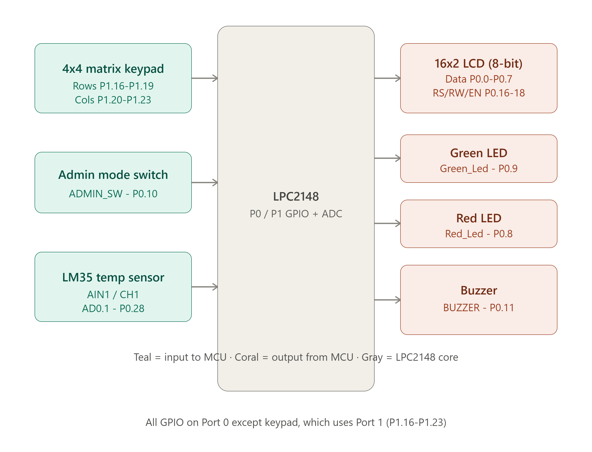

# ARM_Mini_project
EVENT BOARD: RTC-DRIVEN MESSAGE DISPLAY  SYSTEM

## Overview
- Automatically displays predefined messages on an LCD with a scrolling mechanism at specific times.
- Developed using the LPC2148 ARM7 Microcontroller.
- Uses the on-chip RTC to trigger scheduled messages at exact hour/minute matches.
- Stores 10 fixed messages in controller memory, each with its own schedule.
- Provides secure admin access through a switch and password-protected keypad.
- Allows editing of the current RTC time in a fully user-interactive manner.
- Allows selecting/deselecting which messages are active for the day.
- Falls back to displaying real-time clock and room temperature when no message is scheduled.
- Uses an LM35 sensor and the on-chip ADC for temperature monitoring.
- Uses Green/Red LEDs to indicate active scheduled display vs idle display mode.
- Demonstrates Embedded C programming, RTC, ADC, GPIO, and keypad interfacing.

## Block Diagram

  

## Project Images And Videos
https://drive.google.com/drive/folders/15Vhbp0AVr13JE6l9_vvnTzmXvV_bJqS7

## Features
- RTC-based scheduled message display
- 16x2 LCD with scrolling text
- Password-protected admin mode
- Interactive RTC time editing
- Per-message enable/disable selection
- Real-time clock and temperature fallback display
- LM35-based temperature monitoring via ADC
- 4x4 matrix keypad for password and menu entry
- Green/Red LED status indication
- Buzzer for feedback

## Hardware Requirements
- LPC2148 ARM7 Microcontroller
- 16x2 LCD Display
- 4x4 Matrix Keypad
- Switch (for Admin Mode)
- LM35 Temperature Sensor
- Green LED
- Red LED
- Buzzer
- Power Supply

## Software Requirements
- Embedded C
- Keil C Compiler (µVision)
- Flash Magic

## Pin Configuration

| Peripheral | Signal | Pin |
|---|---|---|
| LCD | Data bus (8-bit) | P0.0 - P0.7 |
| LCD | RS | P0.16 |
| LCD | RW | P0.17 |
| LCD | EN | P0.18 |
| Red LED | Red_Led | P0.8 |
| Green LED | Green_Led | P0.9 |
| Admin Switch | ADMIN_SW | P0.10 |
| Buzzer | BUZZER | P0.11 |
| LM35 | AIN1 / CH1 (AD0.1) | P0.28 |
| Keypad | Rows (ROW0-ROW3) | P1.16 - P1.19 |
| Keypad | Columns (COL0-COL3) | P1.20 - P1.23 |

## Working Principle
1. The system initializes RTC, LCD, ADC, and keypad on boot.
2. All 10 messages are enabled by default at startup.
3. The main loop continuously compares the current RTC time against the message schedule.
4. If an enabled message matches the current time, it is displayed on the LCD with scrolling, and the Green LED turns ON.
5. If no message is scheduled at the current time, the LCD shows the real-time clock and room temperature (via LM35 + ADC), and the Red LED turns ON.
6. Toggling the Admin switch and entering the correct password on the keypad grants access to Admin Mode.
7. In Admin Mode, the user can edit the RTC time step-by-step or enable/disable individual messages.
8. Exiting Admin Mode resumes normal scheduled/idle display operation.

## Modules Used
- LCD Interface
- Keypad Interface
- RTC Interface
- ADC / LM35 Temperature Interface
- Admin Mode / Password Authentication Module
- LED Status Indication Module
- Buzzer Feedback Module

## Applications
- Classroom / Lecture Hall Notice Boards
- Institutional Event Scheduling Displays
- Office Reminder and Announcement Boards
- Lab and Workshop Schedule Displays
- General Purpose Timed Notice Boards

## Future Enhancements
- Wireless/remote message updates
- IoT-based scheduling and monitoring
- Mobile application support for message configuration
- Support for more than 10 messages with dynamic memory
- Larger graphical display support

## Technologies Used
- Embedded C
- LPC2148 ARM7
- RTC (Real-Time Clock)
- ADC (Analog-to-Digital Converter)
- GPIO Interfacing
- Keypad Scanning

## Project Outcomes
- Developed an **RTC-driven automated message display system** using Embedded C.
- Implemented **scheduled message display** with LCD scrolling based on real-time clock matching.
- Added **secure password authentication** for admin access to prevent unauthorized edits.
- Integrated **LCD display module** for messages, time, and temperature feedback.
- Enabled communication between multiple peripherals like **LCD, keypad, RTC, and ADC**.
- Designed a **status-driven system** using Green/Red LEDs to indicate operating mode.
- Achieved modular code structure by separating functionalities into different `.c` and `.h` files.
- Ensured reliable time-matching logic and accurate message scheduling.
- Strengthened understanding of embedded system concepts such as **RTC programming, ADC interfacing, and GPIO control**.
- Built a scalable foundation for applications like **smart notice boards and scheduling systems**.

---

## Conclusion
- Successfully developed an RTC-driven message display system using Embedded C.
- Ensures secure access through password-protected admin mode.
- Provides user-friendly time editing and message selection.
- Demonstrates RTC programming, ADC interfacing, and keypad/LCD control.
- Enhances automated scheduling and environmental monitoring in a single embedded system.
- Suitable for future smart notice board and IoT-based scheduling applications.
